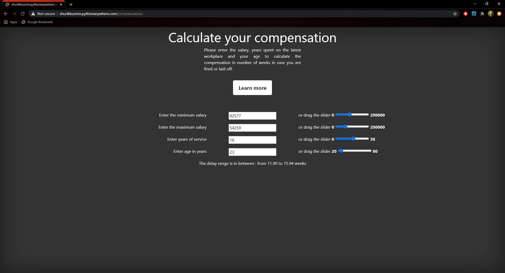

# The machine learning algorithm for determining the compensation in number of weeks when the person is laid off. The website is available [here](http://shurikkuzmin.pythonanywhere.com/compensation/).

